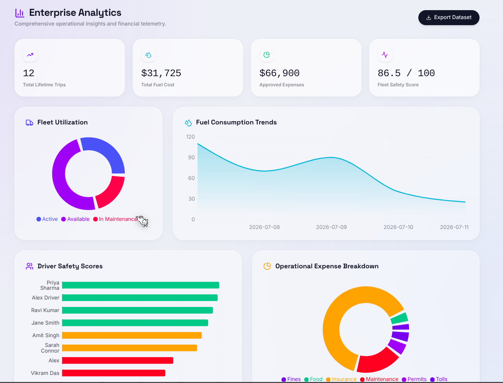
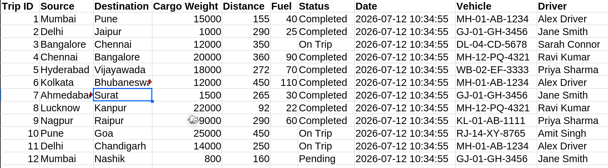

  <h1>🚛 TransitOps</h1>
  
<strong>Next-Generation Enterprise Fleet Management & Logistics Platform</strong>

  

    
    
    
    
    
  

 

TransitOps is a highly scalable, full-stack logistics and fleet management platform engineered for modern enterprise operations. It provides role-based access, real-time analytics, secure trip dispatching, and granular financial telemetry all wrapped in a stunning, premium glassmorphism UI.

## ✨ Core Features
- **Strict Role-Based Access Control (RBAC):** Distinct, isolated workflows for Fleet Managers, Dispatchers, Drivers, Financial Analysts, and Safety Officers.
- **Enterprise Reporting Engine:** Real-time data visualization utilizing `Recharts` for fleet utilization, driver safety scores, and fuel consumption trends.
- **Secure Architecture:** JWT-based stateless authentication, bcrypt password hashing, `Helmet` security headers, and strict rate-limiting.
- **Trip Lifecycle Management:** End-to-end trip assignment, cargo validation, driver dispatching, and completion tracking.
- **Financial Telemetry:** Dynamic revenue/expense forecasting and one-click structured CSV exports.

## 💻 Tech Stack
- **Frontend:** React 18, Vite, Tailwind CSS v4, Recharts, Lucide React, React Router v6.
- **Backend:** Node.js, Express.js, `better-sqlite3` (synchronous high-performance SQLite).
- **Security:** `jsonwebtoken`, `bcryptjs`, `express-rate-limit`, `helmet`, `cors`.

---

## 🚀 Quick Start / Installation

Follow these instructions to run TransitOps locally for judging or development.

### 1. Clone the Repository
\`\`\`bash
git clone https://github.com/aucxtix/transitOPS.git
cd transitOPS
\`\`\`

### 2. Setup the Backend
\`\`\`bash
cd backend
npm install
npm run seed  # Generates the SQLite database with rich dummy data
npm start     # Starts the API on http://localhost:8000
\`\`\`

### 3. Setup the Frontend
Open a new terminal window:
\`\`\`bash
cd frontend
npm install
npm run dev   # Starts the Vite dev server on http://localhost:5173
\`\`\`

### 4. Demo Credentials
Use these credentials to test the various Role-Based Access controls. Password for all accounts is: **`Admin@123`** (or relevant suffix).

| Role | Email | Password |
| :--- | :--- | :--- |
| **Fleet Manager** | `admin@transitops.com` | `Admin@123` |
| **Dispatcher** | `dispatcher@transitops.com` | `Dispatch@123` |
| **Safety Officer** | `safety@transitops.com` | `Safety@123` |
| **Financial Analyst** | `finance@transitops.com` | `Finance@123` |
| **Driver** | `alex@transitops.com` | `Driver@123` |

---

# 📸 Application Showcase

## 🔐 Secure Authentication Portal

The authentication screen serves as the secure entry point into TransitOps. Users can log in using role-based credentials, with each authenticated role receiving a customized dashboard and permissions.

**Highlights**

- JWT-based authentication
- Secure password hashing (bcrypt)
- Role-based login
- Dark / Light theme support
- Modern enterprise UI

  

---

## 🚚 Fleet Manager Dashboard

The Fleet Manager dashboard provides a centralized operational overview of the entire fleet.

Managers can monitor:

- Fleet utilization
- Vehicle availability
- Active trips
- Driver statistics
- Maintenance alerts
- Financial summaries
- Operational KPIs

The dashboard is optimized for quick decision-making using real-time visual analytics.

  

---

## 🚛 Trip Management & Dispatch Center

The Trip Management module enables dispatchers and fleet managers to efficiently create, assign, monitor, and complete transportation operations.

Core capabilities include:

- Trip creation
- Vehicle assignment
- Driver assignment
- Cargo validation
- Trip dispatch
- Trip completion
- Status tracking
- Business rule enforcement

Backend validations ensure:

- No vehicle can be dispatched twice
- Suspended drivers cannot be assigned
- Capacity limits are enforced
- Vehicle and driver status updates remain synchronized

  

---

## 👨‍✈️ Driver Dashboard

Each driver receives a personalized dashboard focused only on information relevant to their responsibilities.

The Driver Dashboard includes:

- Assigned trips
- Trip history
- Active route status
- Safety information
- Personal profile
- Schedule overview

Role-Based Access Control ensures drivers cannot access administrative modules or modify fleet resources.

  

---

## 🛡️ Enterprise Security & Rate Limiting

TransitOps incorporates multiple security layers to protect operational data and backend services.

Implemented security measures include:

- JWT Authentication
- Role-Based Authorization
- Password Hashing
- Rate Limiting
- Helmet Security Headers
- Input Validation
- Protected APIs
- Backend Permission Enforcement

Rate limiting safeguards the application against brute-force attacks and API abuse while maintaining service availability.

  

---

## 🌍 Global Telemetry & Fleet Tracking (Premium)

For enterprise-scale operations, TransitOps provides a state-of-the-art telemetry visualization system. This module aggregates live GPS, IoT sensor data, and route optimization algorithms into a single pane of glass.

- Live geospatial tracking of all active vehicles
- Route optimization utilizing edge-node calculations
- Supply chain bottleneck visualization
- Real-time weather and traffic overlays

  

---

## 📈 Advanced Financial Analytics

To ensure maximum profitability and operational efficiency, TransitOps includes a dedicated Financial Analytics suite designed for enterprise analysts.

- Dynamic revenue vs expense forecasting
- AI-driven maintenance cost prediction
- Granular expense breakdowns (Tolls, Fuel, Fines)
- Automated report generation and CSV exports

  

---

## 📈 Comprehensive Enterprise Reporting

The Reports module acts as the analytical brain of TransitOps, translating raw SQL data into actionable insights through dynamic, interactive data visualization.

- Distance vs Fuel consumption benchmarking
- Real-time fleet utilization analytics
- Driver safety ranking metrics
- Area charts for fuel consumption over time

  

### 📥 One-Click Data Export
Generate highly structured, formatted CSV dataset exports for offline review and legacy system integration in milliseconds.

  

---

## 📊 Role-Based Experience

Every user experiences a different application based on organizational responsibilities.

Supported roles include:

- Fleet Manager
- Dispatcher
- Driver
- Financial Analyst
- Safety Officer

Each role receives:

- Dedicated dashboard
- Custom navigation
- Restricted APIs
- Controlled actions
- Independent workflows

This architecture ensures both security and operational clarity.

  

