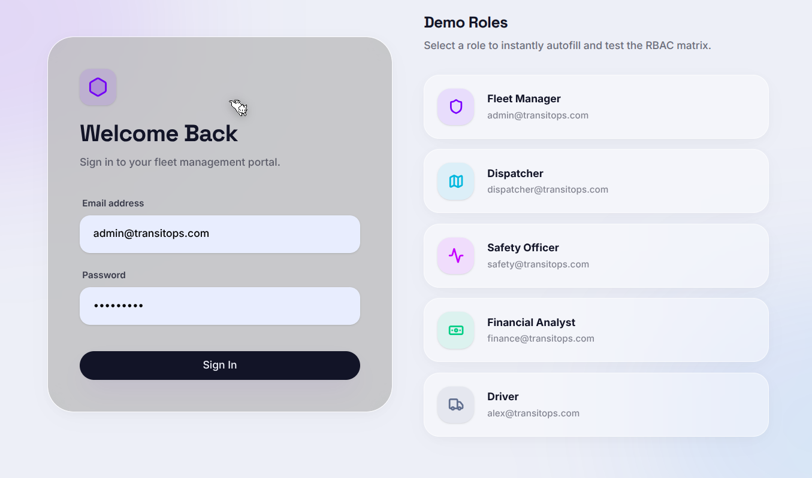
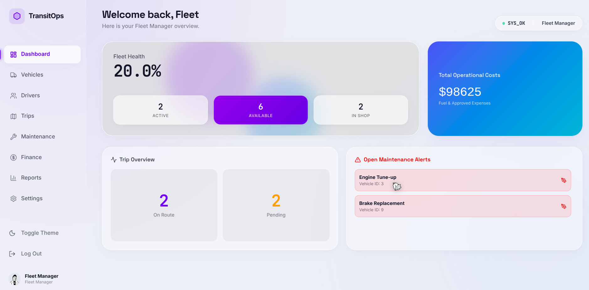
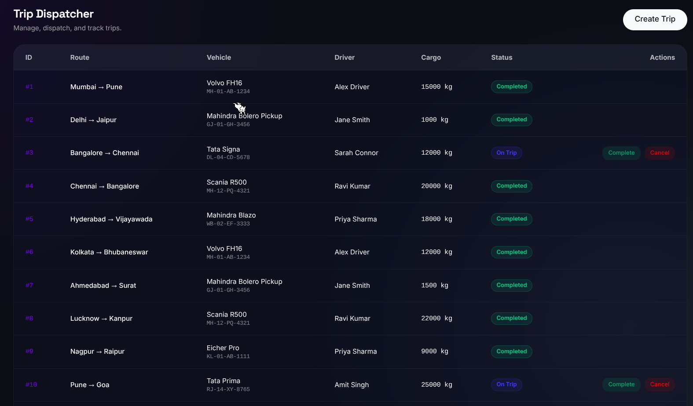
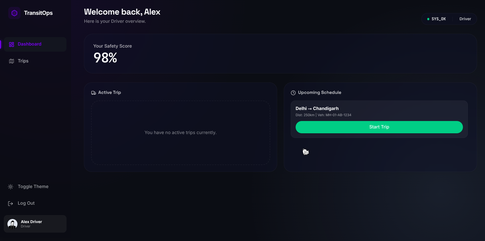
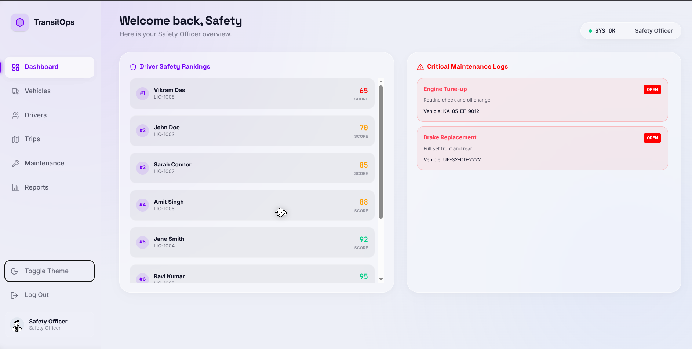

# 📸 Application Preview

TransitOps is designed as a modern enterprise fleet management platform. Below are key interfaces that demonstrate the application's security, usability, and operational workflows.

---

## 🔐 Secure Authentication Portal

The authentication screen serves as the secure entry point into TransitOps. Users can log in using role-based credentials, with each authenticated role receiving a customized dashboard and permissions.

**Highlights**

- JWT-based authentication
- Secure password hashing (bcrypt)
- Role-based login
- Dark / Light theme support
- Modern enterprise UI

  

---

## 🚚 Fleet Manager Dashboard

The Fleet Manager dashboard provides a centralized operational overview of the entire fleet.

Managers can monitor:

- Fleet utilization
- Vehicle availability
- Active trips
- Driver statistics
- Maintenance alerts
- Financial summaries
- Operational KPIs

The dashboard is optimized for quick decision-making using real-time visual analytics.

  

---

## 🚛 Trip Management & Dispatch Center

The Trip Management module enables dispatchers and fleet managers to efficiently create, assign, monitor, and complete transportation operations.

Core capabilities include:

- Trip creation
- Vehicle assignment
- Driver assignment
- Cargo validation
- Trip dispatch
- Trip completion
- Status tracking
- Business rule enforcement

Backend validations ensure:

- No vehicle can be dispatched twice
- Suspended drivers cannot be assigned
- Capacity limits are enforced
- Vehicle and driver status updates remain synchronized

  

---

## 👨‍✈️ Driver Dashboard

Each driver receives a personalized dashboard focused only on information relevant to their responsibilities.

The Driver Dashboard includes:

- Assigned trips
- Trip history
- Active route status
- Safety information
- Personal profile
- Schedule overview

Role-Based Access Control ensures drivers cannot access administrative modules or modify fleet resources.

  

---

## 🛡️ Enterprise Security & Rate Limiting

TransitOps incorporates multiple security layers to protect operational data and backend services.

Implemented security measures include:

- JWT Authentication
- Role-Based Authorization
- Password Hashing
- Rate Limiting
- Helmet Security Headers
- Input Validation
- Protected APIs
- Backend Permission Enforcement

Rate limiting safeguards the application against brute-force attacks and API abuse while maintaining service availability.

  

---

## 🌍 Global Telemetry & Fleet Tracking (Premium)

For enterprise-scale operations, TransitOps provides a state-of-the-art telemetry visualization system. This module aggregates live GPS, IoT sensor data, and route optimization algorithms into a single pane of glass.

- Live geospatial tracking of all active vehicles
- Route optimization utilizing edge-node calculations
- Supply chain bottleneck visualization
- Real-time weather and traffic overlays

  

---

## 📈 Advanced Financial Analytics

To ensure maximum profitability and operational efficiency, TransitOps includes a dedicated Financial Analytics suite designed for enterprise analysts.

- Dynamic revenue vs expense forecasting
- AI-driven maintenance cost prediction
- Granular expense breakdowns (Tolls, Fuel, Fines)
- Automated report generation and CSV exports

  

---

## 📊 Role-Based Experience

Every user experiences a different application based on organizational responsibilities.

Supported roles include:

- Fleet Manager
- Dispatcher
- Driver
- Financial Analyst
- Safety Officer

Each role receives:

- Dedicated dashboard
- Custom navigation
- Restricted APIs
- Controlled actions
- Independent workflows

This architecture ensures both security and operational clarity.

  

